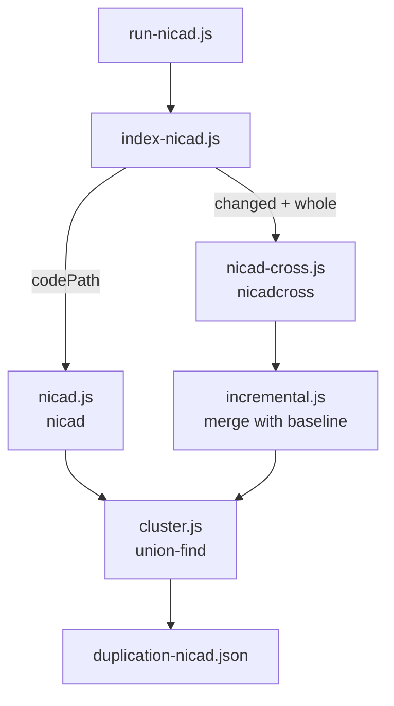

# Progressive Analysis — Duplication

Code clone detection for Java projects. The workspace holds two independent apps
that share the same result shape:

| app    | entry point                       | detector                   |
| ------ | --------------------------------- | -------------------------- |
| Simian | `run.js` → `index.js`             | Simian 4.0.0 (bundled JAR) |
| NiCad  | `run-nicad.js` → `index-nicad.js` | NiCad 7.0 via WSL          |

This document covers the **NiCad app**, which supports both full and incremental
analysis.

---

## Requirements

- **Node.js** with the dependencies in `package.json` (`shelljs`, `xml2js`, `globby`, `dotenv`).
- **WSL** with a working [Open-NiCad](https://github.com/CordyJ/Open-NiCad)
  installation at `~/Open-NiCad`, built with `make`. NiCad is invoked in place via
  `./bin/nicad`, so no system-wide install is needed.

---

## Running

Everything is driven from `run-nicad.js`. The mode is chosen by which paths you
fill in — there is no flag.

### Full analysis

Analyzes an entire project from scratch and writes the baseline that incremental
runs later build on.

```js
await calculateDuplication({
  codePath: "../Java",
  changedFilesSetPath: "",
  wholeProjectNewVersionPath: "",
  resultsPath: "./results",
});
```

### Incremental analysis

Reanalyzes only what a commit could have affected, reusing the previous result
for everything else.

```js
await calculateDuplication({
  codePath: "",
  changedFilesSetPath: "../changed-files/Java",
  wholeProjectNewVersionPath: "../whole-project/Java",
  resultsPath: "./results",
});
```

Both paths are **directory roots**. Everything below them mirrors `codePath`, so
the same file appears at the same relative path in all three trees:

```
../Java/src/main/MyClass.java                 full analysis
../whole-project/Java/src/main/MyClass.java   the project after the commit
../changed-files/Java/src/main/MyClass.java   only if the commit touched it
```

All three normalize to `src/main/MyClass.java`, which is the key used for
merging, for filtering, and in the output.

`changed-files` holds only the files the commit touched. `whole-project` holds
the complete project including those files. That overlap is deliberate — it is
what lets NiCadCross find clones _between two changed files_.

> The app knows nothing about git. How the two trees get populated is up to you.

---

## Before every run: clear NiCad's cache

NiCad caches its extraction step per system name, and the system name is just the
basename of the analyzed directory. Since that name repeats across commits, a
stale cache means **analyzing the previous version's sources while believing you
analyzed the new one** — silently wrong results, not an error.

```bash
rm -rf ~/Open-NiCad/nicadclones/Java \
       ~/Open-NiCad/nicadclones/whole \
       ~/Open-NiCad/nicadclones/changed
```

NiCad ships `bin/nicadclean`, but it prompts interactively and will hang when run
without a terminal, so the app does not call it.

---

## How incremental analysis works

### The pipeline



Both modes end at the same clustering step, which is what makes their outputs
directly comparable.

### 1. NiCadCross covers everything the commit could have changed

`nicadcross` reports clones of fragments of the first system in the second. With
`whole` as the first and `changed` as the second, every reported pair has a
changed file on at least one side:

| clone between                           | covered by            |
| --------------------------------------- | --------------------- |
| changed ↔ changed (different files)     | NiCadCross            |
| changed ↔ changed (same file, internal) | NiCadCross            |
| changed ↔ unchanged                     | NiCadCross            |
| unchanged ↔ unchanged                   | the previous analysis |

The last row is the entire speedup: those comparisons are skipped and their
results carried over instead.

### 2. Self-pairs are filtered out

Every changed file exists in _both_ systems, so each of its blocks also matches
its own copy at 100%. Those pairs are dropped.

The filter compares `filePath`, `start_line` **and** `end_line`. Matching on path
alone would also delete genuine clones _within_ one file — which do occur in
practice, e.g. `NumberPersistence.java` [32-49] ~ [61-78]. Two distinct blocks can
never share a line range, so range-matching removes only true identity pairs.

### 3. Old pairs are carried over selectively

A pair from the previous analysis survives only if **both** its files are

- absent from the changed set, and
- still present in whole-project (this handles deletions and renames).

### 4. Everything is re-clustered

The carried-over pairs and the new pairs are merged, deduplicated, and grouped
into clone classes with union-find.

### Why pairs and not classes

This is the central design decision. The stored result keeps `clone_pairs`, not
just `code_clones`, because **a clone class cannot be correctly edited after the
fact**.

A class records which blocks belong together, but not which of them were actually
similar. Suppose `A` and `B` are in unchanged files, `X` is in a changed one, and
NiCad found `A~X` and `B~X` but never `A~B`:

```
A ──~── X ──~── B          stored class: {A, B, X}
```

If the commit rewrites `X` so it is no longer a clone, the class should dissolve
completely. But merging at class level would "remove the changed file" and report
`{A, B}` — a duplicate that **does not exist**. The same gap works in reverse: a
new block bridging two existing classes should merge them, and class-level data
gives no way to know.

With pairs, both cases fall out automatically: `A~X` and `B~X` are dropped because
they touch a changed file, and union-find re-derives the grouping from scratch.

NiCad writes the pairs file on every run anyway, so this costs one extra parse.

---

## Modules

| file              | responsibility                                                               |
| ----------------- | ---------------------------------------------------------------------------- |
| `run-nicad.js`    | the paths you edit                                                           |
| `index-nicad.js`  | mode selection, orchestration, writing results                               |
| `nicad.js`        | full analysis — runs `nicad`, returns clone pairs                            |
| `nicad-cross.js`  | incremental analysis — runs `nicadcross`, filters self-pairs                 |
| `nicad-common.js` | shared WSL plumbing: paths, config install, results discovery, pairs parsing |
| `incremental.js`  | baseline handling and the carry-over filter                                  |
| `cluster.js`      | pairs → clone classes + counters (tool-agnostic)                             |

`loc.js`, `results.js` and `exceeding-lines.js` belong to the Simian app and are
not used here.

### Two details worth knowing

**System name collision.** `../whole-project/Java` and `../changed-files/Java`
share the basename `Java`, so NiCad would name both systems identically and have
them overwrite each other. `nicad-cross.js` symlinks them to `.staging/whole` and
`.staging/changed` inside the NiCad directory, giving distinct system names
without copying the trees.

**Config line endings.** The `.cfg` is authored on Windows, and NiCad parses it
line by line — a trailing `\r` becomes part of each value, so `transform=none`
arrives as `none\r` and the run dies with a usage error immediately after
extraction. `installConfig()` runs `sed -i 's/\r$//'` after copying, so this
cannot recur regardless of how the file is saved.

---

## Configuration

`utils/progressive-analysis.cfg` is copied into
`~/Open-NiCad/lib/nicad/config/` at the start of every run.

```
threshold=0.10     max 10% different lines (near-miss)
minsize=15         ignore blocks under 15 lines
maxsize=2500
rename=blind       identifiers normalized to X
```

> **The stored baseline is only valid for the config it was produced with.**
> Changing `threshold` or `minsize` invalidates every stored pair. Re-run a full
> analysis to re-baseline before resuming incremental runs.

---

## Output

Written to `<resultsPath>/duplication-nicad.json`. Incremental runs first copy the
previous file to `duplication-nicad-old.json` (a copy rather than a rename, so a
mid-run failure cannot destroy your only baseline).

```jsonc
{
  "duplication": {
    "general_info": {
      "duplicate_instances": 76, // clone blocks across all classes
      "duplicate_loc": 1518, // their summed line spans
      "classes_containing_clones": 45, // distinct files involved
    },
    "code_clones": [
      // clone classes (clusters)
      {
        "index": 0,
        "clone_instances": 2,
        "clone_loc": 29,
        "files": [
          {
            "filePath": "src/main/java/.../AES.java",
            "start_line": "2569",
            "end_line": "2598",
          },
          {
            "filePath": "src/main/java/.../AES.java",
            "start_line": "2604",
            "end_line": "2633",
          },
        ],
      },
    ],
    "clone_pairs": [
      // the baseline for the next incremental run
      {
        "similarity": "100",
        "files": [
          /* exactly two blocks */
        ],
      },
    ],
  },
  "duplicationMetrics": { "duplicateLOC": 1518 },
}
```

Paths are relative to the project root so they stay stable as `whole-project`
moves between commits. Classes and their members are sorted deterministically, so
two runs over the same code serialize identically and can be compared with a plain
diff.

The call returns an envelope that never throws:

```js
{
  (success, duplication, duplicationMetrics, duplicationScores, error);
}
```

On failure `success` is `false` and `error` carries the cause.

---

## Verifying correctness

The acceptance test is that an incremental run must equal a full run of the same
project version:

1. Full analysis of the old version → baseline.
2. Full analysis of the new version → save it aside.
3. Incremental analysis with the changed set and the new version.
4. Compare `code_clones`.

Because both modes cluster through `cluster.js`, this is a literal comparison:

```js
JSON.stringify(a.code_clones) === JSON.stringify(b.code_clones);
```

Re-clustering the stored `clone_pairs` from two result files reproduces their
`code_clones` without re-running NiCad, which makes this cheap to check.

**Last verified result** — 749 of 1548 files in the changed set (48%):

```
FULL         76 instances / 1518 loc / 45 files    37 classes   40 pairs
INCREMENTAL  76 instances / 1518 loc / 45 files    37 classes   40 pairs
pairs only in full: 0      pairs only in incr: 0      code_clones identical: true
```

---

## Troubleshooting

| symptom                                            | cause                                                                                                                    |
| -------------------------------------------------- | ------------------------------------------------------------------------------------------------------------------------ |
| `ENOENT` on a `-clones` / `-crossclones` directory | NiCad failed before writing results. Check the `.log` in `nicadclones/<system>/`.                                        |
| `Transform ... Usage:` in the log                  | A value reached NiCad with a trailing `\r`. The config copy should prevent this.                                         |
| Results look like the previous commit's            | `nicadclones/` was not cleared; the extraction cache was reused.                                                         |
| Every changed file clones itself                   | The changed tree's content drifted from whole-project, so line ranges no longer match and self-pairs survive the filter. |
| `Incremental analysis needs a previous ...`        | No baseline. Run a full analysis first.                                                                                  |
| `The previous analysis holds no "clone_pairs"`     | The baseline predates the pairs format. Re-run a full analysis.                                                          |

Results live at `\\wsl.localhost\<distro>\home\<user>\Open-NiCad\nicadclones` if
you want to inspect NiCad's own reports.

---

## Open items

- **NiCadCross argument order.** `whole` is passed first and `changed` second. The
  pair set is symmetric, so this does not affect correctness, and the verified run
  returned no spurious pairs. If NiCadCross ever turns out to also report
  intra-system pairs, passing `changed` first would bound the cost to the changed
  set; a run with a small changed set would settle it.
